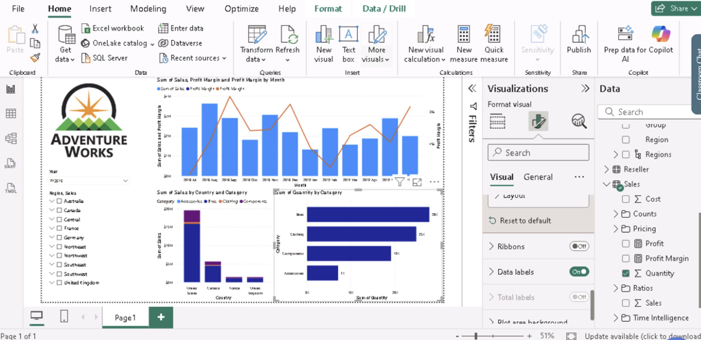

# Adventure Works Sales Dashboard

## Task / Project Title

Adventure Works Sales Dashboard

---

## Skills Demonstrated

- Data visualisation
- Dashboard design
- Sales analysis
- Business intelligence
- Interactive reporting
- Data storytelling
- Microsoft Power BI Desktop

---

## Dataset

### Dataset Name

Adventure Works Sales Dataset

### Description

This dataset contains sales information, including products, countries, categories, costs, profits and revenue. It was used to build an interactive Power BI dashboard to analyse sales performance.

### Source

Bootcamp dataset

---

## Organisation

### Organisation Type

Retail business

### Why is this important?

Retail businesses use dashboards to monitor sales performance, identify trends and support business decision-making.

---

## Tools Used

- Microsoft Power BI Desktop

---

## What I Did

- Imported the dataset into Power BI.
- Cleaned and prepared the data.
- Created relationships between tables.
- Built interactive charts and visuals.
- Added filters and slicers.
- Designed a dashboard to analyse sales performance.

---

## Key Findings

### Finding 1

The dashboard makes it easy to compare sales across different countries and product categories.

**What this means:**

Managers can quickly identify high-performing products and regions.

### Finding 2

Interactive filters allow users to explore the data and answer business questions efficiently.

**What this means:**

This supports faster and better business decisions.

---

## Dashboard

---

## Why This Project Belongs in My Portfolio

This project demonstrates my ability to create interactive dashboards that transform business data into meaningful insights using Microsoft Power BI.
