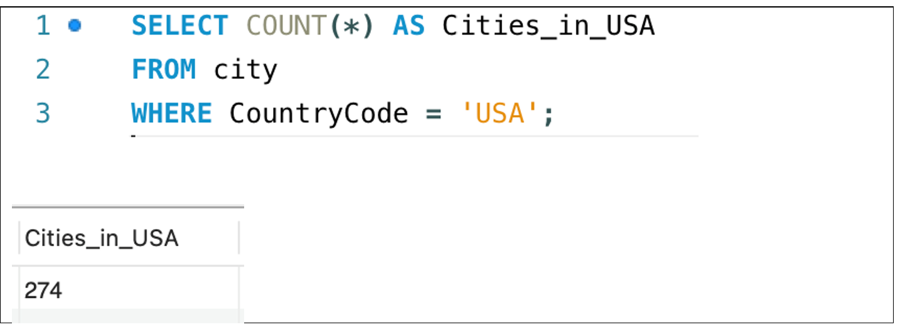
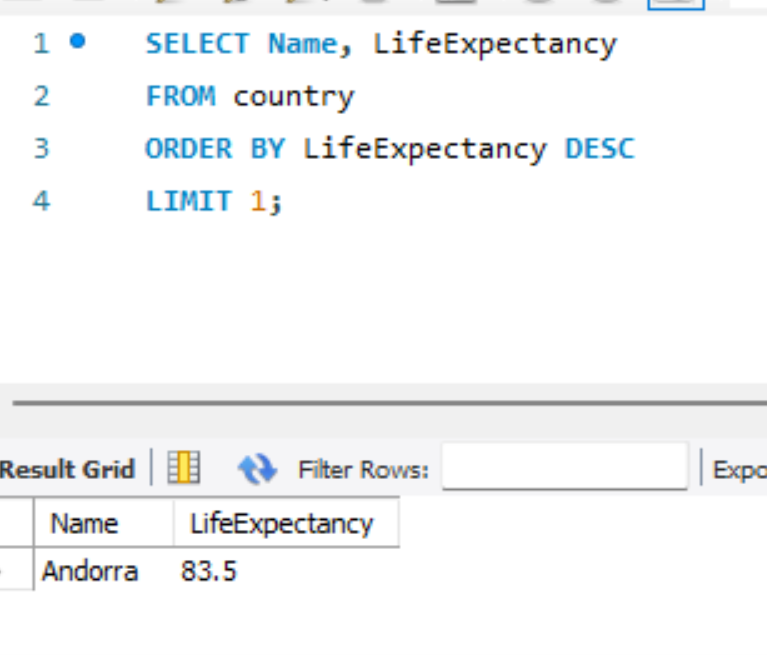
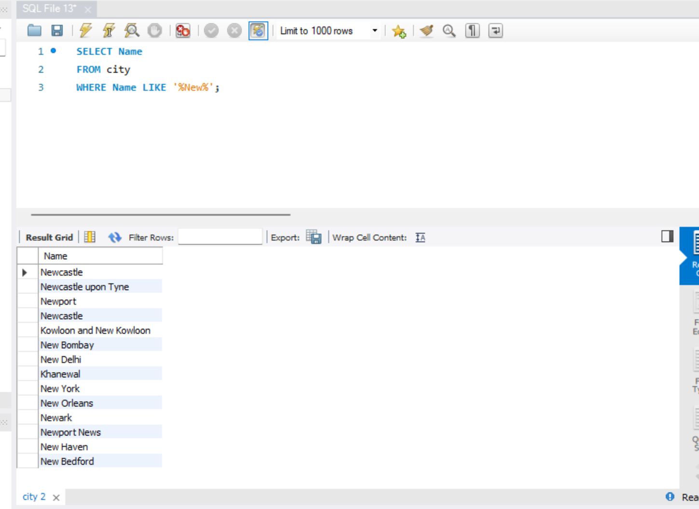

# World Database SQL Project

## Task/Project Title

**Population Analysis Using SQL**

---

## Skills Demonstrated

- SQL querying
- Data filtering and sorting
- Aggregate functions (COUNT, AVG)
- GROUP BY and ORDER BY
- Data analysis
- Relational database querying

---
## SQL Query Examples

### 1. Count Cities in the USA

This query counts the total number of cities in the USA using the `COUNT()` function and a `WHERE` clause.

---

### 2. Country with the Highest Life Expectancy

This query sorts countries by life expectancy in descending order and returns the country with the highest value.

---

### 3. Cities Containing "New"

This query uses the `LIKE` operator to find cities whose names contain the word "New".

---

### 4. Top 10 Most Populated Cities

This query sorts cities by population in descending order and displays the ten most populated cities.

## Dataset

### Dataset Name
World Database

### Description
The World database contains information about countries, cities and languages, including population, life expectancy and GDP. It was used to practise SQL queries and analyse demographic data.

### Source
Bootcamp dataset (World sample database)

### Dataset Summary
The World database contains information about countries, cities and populations from around the world. It allows users to analyse demographic trends, compare countries, identify major cities and answer business questions using SQL queries.

---

## Organisation

### Organisation Type
Government department or research organisation.

### Why is this task important?
These organisations use population and demographic data to support planning, resource allocation and informed decision-making.

---

## Tools Used

- MySQL Workbench
- SQL

---

## What I Did

- Retrieved data using SELECT statements.
- Filtered records using WHERE clauses.
- Sorted data using ORDER BY.
- Limited results using LIMIT.
- Used aggregate functions such as COUNT() and AVG().
- Grouped data using GROUP BY.
- Answered real-world business questions using SQL queries.

---

## Key Findings

 1 SQL queries can quickly retrieve specific information from large datasets.

What this means:This helps organisations make faster and more informed decisions.

 2 Filtering, sorting and grouping data makes it easier to identify useful patterns and trends.

What this means:This supports better planning, reporting and business analysis.

---

## Why This Project Belongs in My Portfolio

This project demonstrates my ability to write SQL queries to retrieve, filter and analyse data from a relational database. It shows that I can use SQL to answer real-world business questions and produce meaningful insights.
